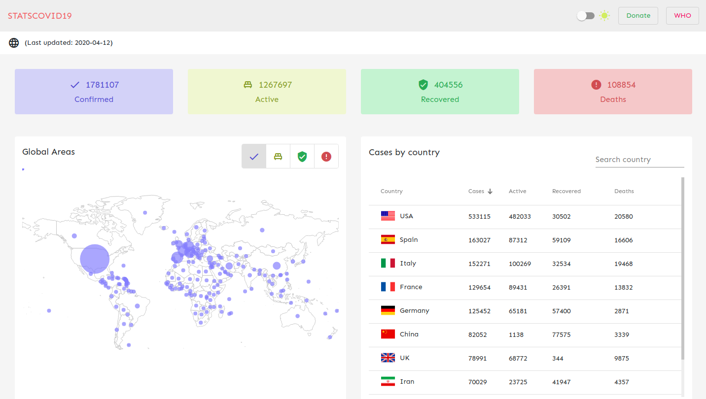
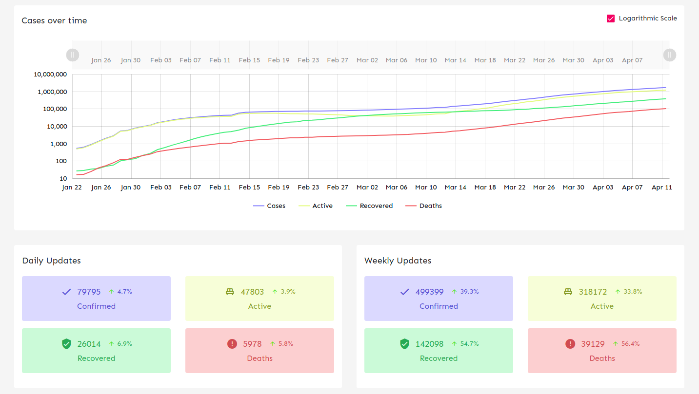
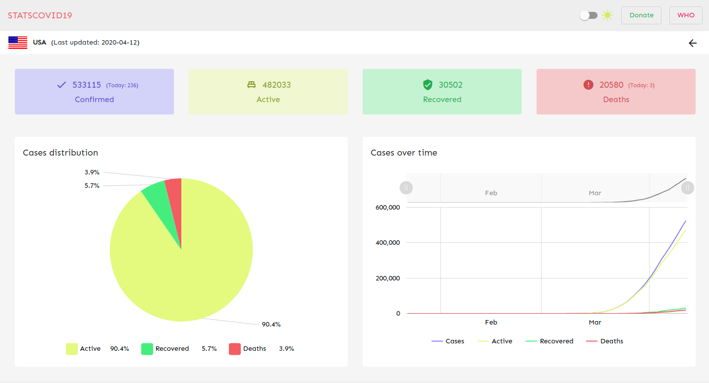

# statscovid19

A dashboard for Covid-19 data visualization using Angular Material. This dashboard provides the covid-19 cases statistics for each country as well as for global.

### [Demo](https://statscovid19.netlify.com/)

### Screenshots

## API used

https://api.coronastatistics.live

